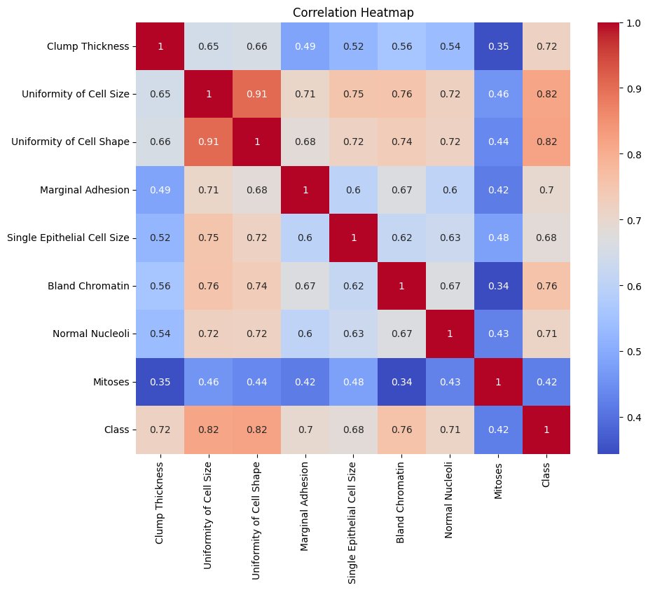
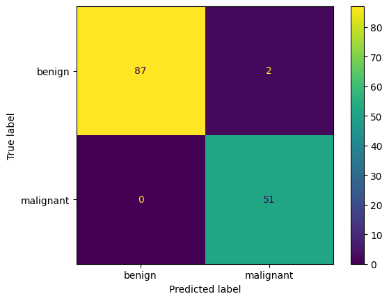
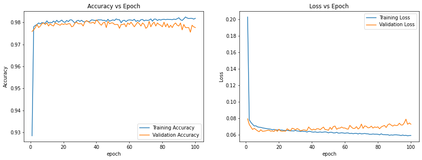
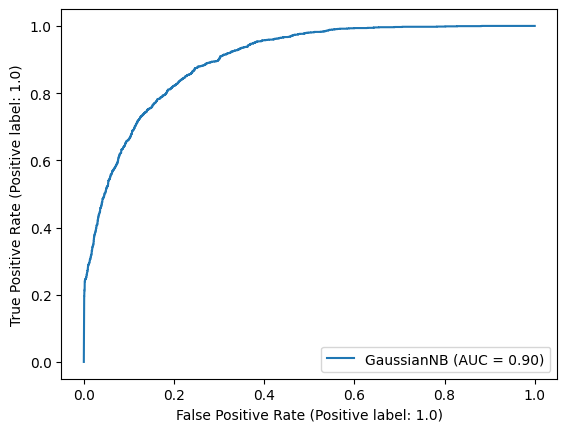

# Machine-Learning-Models
# Summary

### Goal:
Performance comparison of different machine 
learning models & pre-processing techniques 

### Test Focus:
Accuracy, recall and precision

### ML Models Tested:
- K-means
- Naive Bayes
- KNN
- SVM 
- Neural Networks

### Testing Metrics:
- Accuracy, recall, precision
- F1 Score
- Confusion Matrices
- ROC curve

### Description: 
Utilize three unique datasets to test and evaluate different machine learning models and preprocessing techniques to compare how they perform. The models used are K-means, Naive Bayes, KNN, SVM, and Neural Networks.
The performance of the models was determined through accuracy, recall, precision, f1-score, and graphs such as correlation heat maps and confusion matrices. This project let me explore a large variety of machine learning models and preprocessing techniques that can be used as well as how to test them. An example from the testing is shown below where one model is overfitting after a couple of epochs because the validation accuracy is decreasing while the training accuracy is increasing.

Correlation heatmap of the breast cancer wisconsin dataset. This can be used to determine which features to select as input for different models since highly correlated input features are redundant.

Confusion matrix of KNN model on breast cancer wisconsin dataset predicting malignant or benign. The display shows that the model only mispredicted 2 benign cancers as malignant and was otherwise completely accurate.

Accuracy vs Epoch of a 4-layer Densely connected Neural network on pulsar stars dataset. There is evidence of overfitting from the graphs as the validation accurracy is decreasing while the loss is increasing after the first 20 epochs.

ROC curve of Gaussian Naive Bayes model on predicting the people's salary being above or below $50,000. an AUC of 0.9 shows that the model is fairly good and can distinguish above and below $50,000 salary most of the time.

